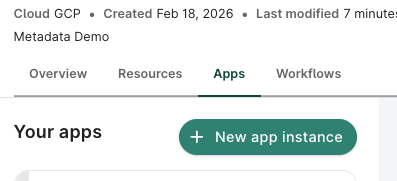
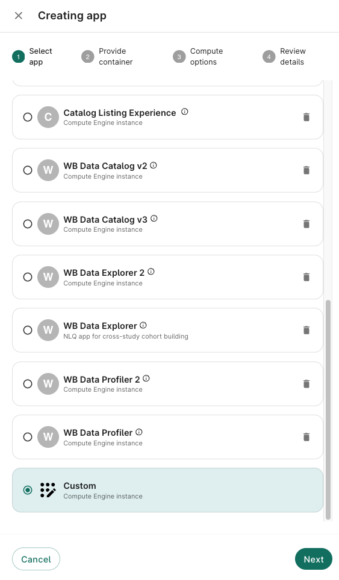
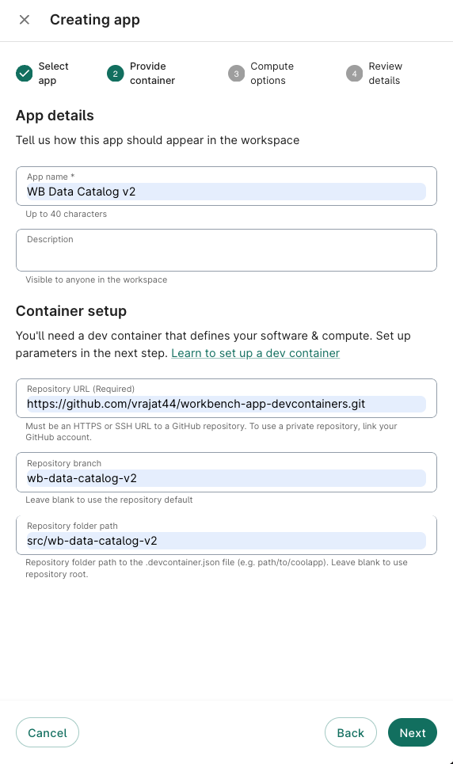

# Installing WB Data Catalog v2 on Workbench

## Prerequisites

- A Verily Workbench workspace with OWNER or WRITER access
- At least one BigQuery dataset in the workspace (or a referenced data project)

## Steps

### Step 1: Open the Apps tab

In your Workbench workspace, go to the **Apps** tab and click **+ New app instance**.

### Step 2: Select Custom app type

Scroll down the app type list and select **Custom** at the bottom. Click **Next**.

### Step 3: Configure the container

Fill in the following fields:

| Field | Value |
|-------|-------|
| **App name** | `WB Data Catalog v2` |
| **Description** | (optional) Self-service data catalog with AI profiling |
| **Repository URL** | `https://github.com/vrajat44/workbench-app-devcontainers.git` |
| **Repository branch** | `wb-data-catalog-v2` |
| **Repository folder path** | `src/wb-data-catalog-v2` |

Click **Next**.

### Step 4: Compute options

Use the defaults or adjust based on your needs:

| Setting | Recommended |
|---------|------------|
| **Machine type** | `e2-standard-4` (4 vCPU, 16 GB) or higher |
| **Disk size** | 50 GB (default is fine) |
| **Region** | Same region as your BigQuery datasets (e.g., `us-central1`) |

Click **Next**.

### Step 5: Review and create

Review the details and click **Create**. The app will take 2-5 minutes to build and start.

### Step 6: Open the app

Once the status shows **Running**, click **Open** to launch the Data Catalog. The app auto-detects your workspace's GCP project and starts loading datasets.

## First-time setup

On first launch:

1. The app auto-detects your workspace project. If needed, go to **Settings** in the sidebar to change the billing or data project.
2. Click a dataset to expand it and see its tables.
3. Select tables and click **Profile entire project** to generate metadata.
4. See [USAGE_GUIDE.md](USAGE_GUIDE.md) for full usage instructions.

## Troubleshooting

| Issue | Fix |
|-------|-----|
| App shows "Loading datasets..." forever | The GCP project may not have BQ datasets, or permissions are missing. Check Settings. |
| Profiling fails | Ensure the workspace service account has BigQuery Data Viewer and Storage Object Admin on the profile bucket. |
| Chat shows "No context" | Profile at least one table first. The chat agent needs profiling data to answer questions. |
| Can't access Vertex AI / Gemini | Ensure the Vertex AI API is enabled in your billing project and the service account has `aiplatform.user` role. |
