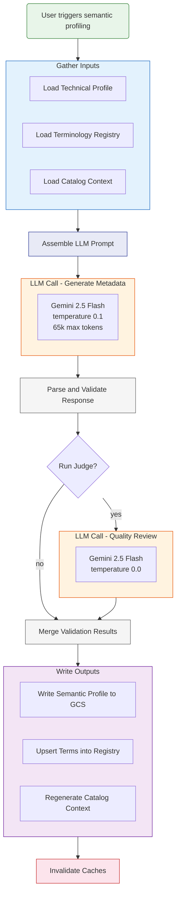

# Semantic Profiling — Data Flow

## What each step does

### Gather Inputs
- **Technical Profile** — schema, null rates, distinct counts, top values, patterns, numeric ranges, anomalies
- **Terminology Registry** — existing standard (LOINC, SNOMED, ICD-10, RxNorm) and custom concept bindings from previously profiled tables
- **Catalog Context** — neighbor table summaries for cross-table join suggestions

### Assemble LLM Prompt
Builds a user message containing:
- Table name and row count
- Per-column stats line (type, nulls%, distincts, top values, patterns, ranges, anomalies)
- Up to 200 existing registry entries to reuse
- Optional context text (data dictionary, protocol docs)

### LLM Call - Generate Metadata
System prompt instructs the model to return JSON with:

**Table-level fields:**
- `business_name` — short human-friendly name
- `table_definition` — 2-3 sentence description
- `primary_key` — columns, type (single/composite/none), confidence
- `granularity` — what one row represents
- `semantic_domain` — from 16-category fixed taxonomy
- `entity_anchor` — column identifying the primary entity
- `cohort_dimensions` — columns useful as categorical cohort filters

**Column-level fields:**
- `definition` — plain-language description
- `terminology_bindings` — standard codes (LOINC, SNOMED, etc.) or custom (`urn:verily:custom`)
- `sensitivity` — PHI, PII, UID, or empty
- `join_paths` — likely joins to other tables
- `confidence` — high, medium, or low
- `unit_of_measure` — e.g. mg/dL, kg, years
- `measurement_method` — one of: self-reported, clinician-reported, lab-measured, device-collected, derived, administrative

### Parse and Validate Response
1. Extract JSON from response (strip markdown fences)
2. Cross-check: flag any hallucinated columns not in the technical profile
3. Normalize values (sensitivity uppercase, confidence lowercase, measurement_method to 6 allowed values)
4. Collect applicability warnings (no PK found, generic domain, missing units)

### LLM Call - Quality Review (optional)
A second LLM pass at temperature 0.0 that reviews the generated metadata for:
- Definition accuracy and specificity
- Terminology binding correctness
- Sensitivity classification
- Join path reasonableness
- Primary key identification

Returns: pass / warning / fail with issues and warnings lists

### Merge Validation Results
- Cross-check issues → **fail**
- Judge returns fail → **fail**
- Applicability gaps → **warning**
- Otherwise → **pass**

### Write Outputs
- **Semantic Profile** → written to GCS as `semantic_profile.json`
- **Terminology Entries** → upserted into project-level registry (dedup and reconcile)
- **Catalog Context** → regenerated markdown summary for chat agent and NL cohort queries

### Invalidate Caches
Clears catalog, scan, terminology, cohort dimensions, and column values caches so the UI reflects the new profiles immediately.
